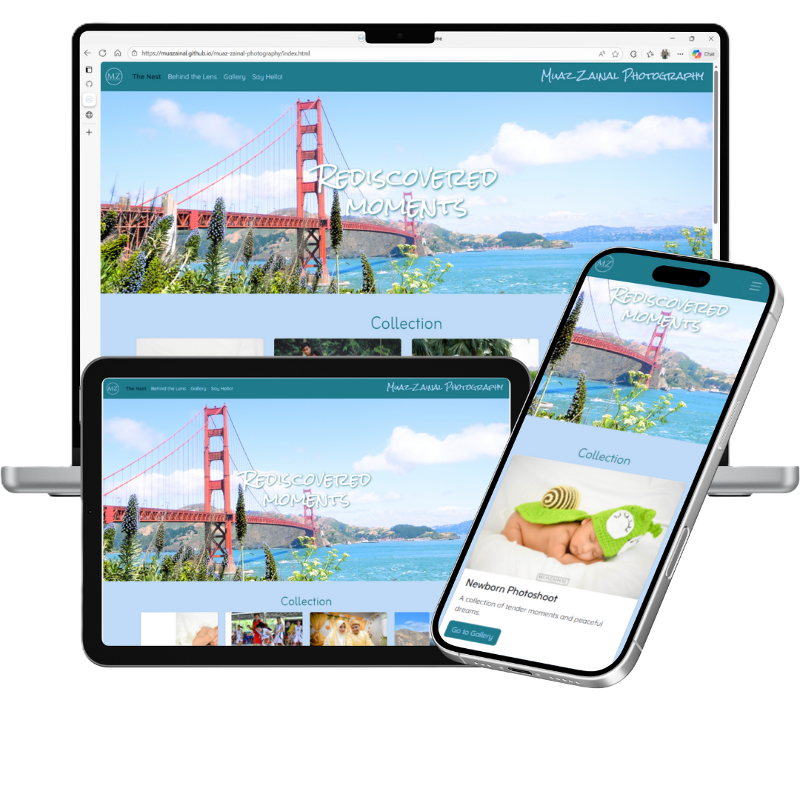
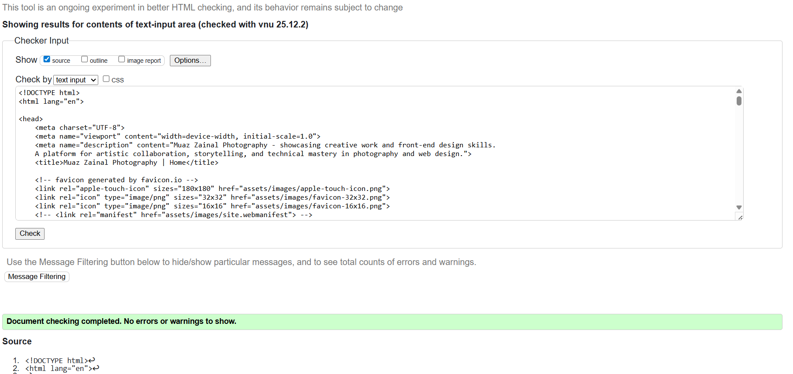
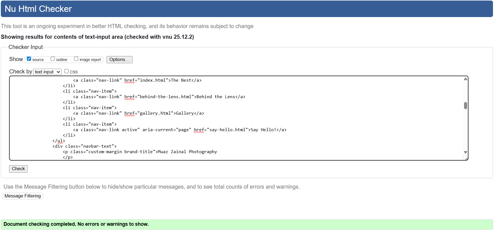
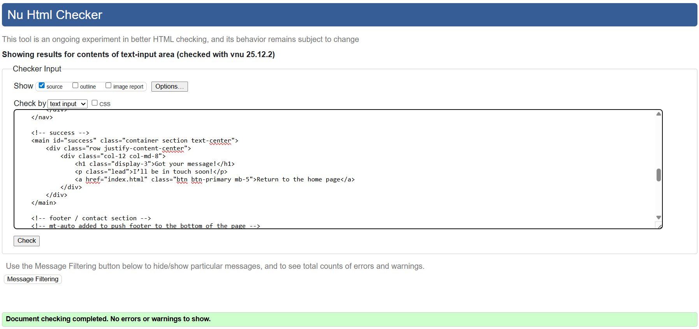
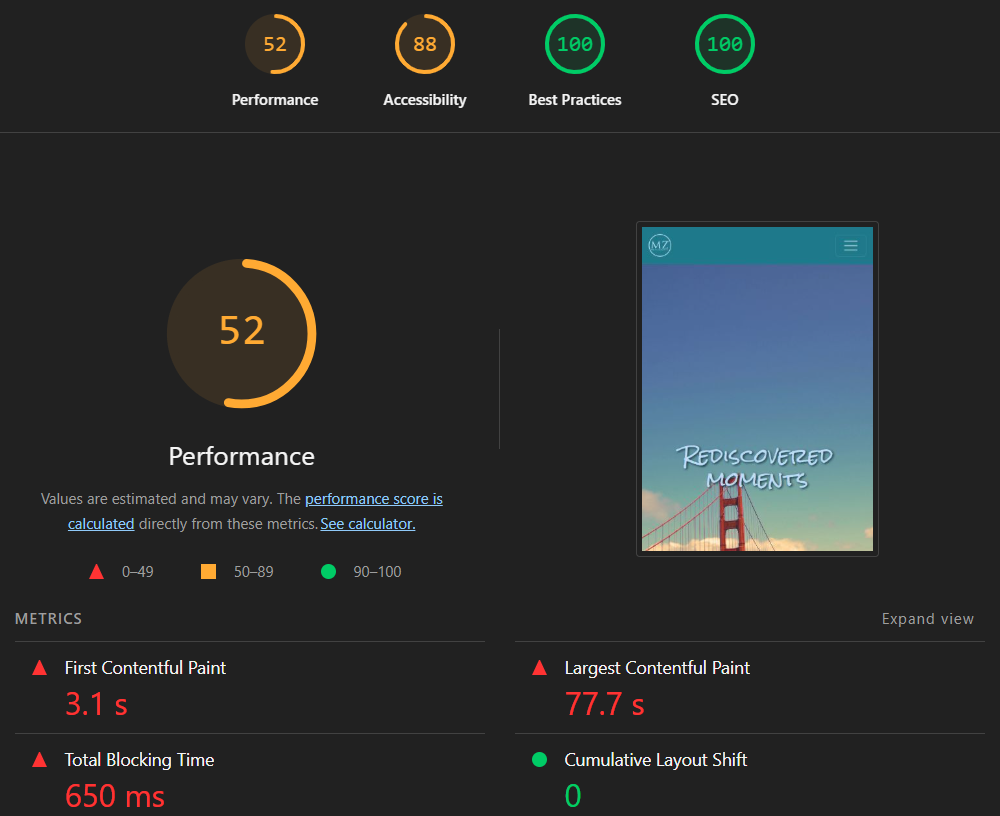

# 📸 Mu'az Zainal Photogrpahy

[Live Site](https://muazainal.github.io/muaz-zainal-photography/)

---

##  Table of Contents
- [Purpose](#purpose)
- [Features & Benefits](#features--benefits)
- [Deployment](#deployment)
- [Screenshots](#screenshots)
- [Performance Tests](#performance-tests)
- [Bugs & Errors](#bugs--errors)
- [Attributions](#attributions)
- [AI Declaration](#ai-declaration)
- [Colour Palette](#colour-palette)
- [Wireframes](#wireframes)
- [Planned Updates](#planned-updates)

---

## Purpose

This site is a personal photography portfolio and creative playground.  
It showcases my work, experiments with layout and storytelling, and invites collaboration.  
Built to reignite my passion for visual storytelling and front-end development.

---

## Features & Benefits

- Responsive gallery layout using pure HTML/CSS  
- Moodboard-style image arrangements for immersive browsing  
- Poetic navigation labels like “The Nest” and “Behind the Lens”  
- Motivational quotes and personal reflections woven into the design  
- Optimized for mobile and desktop viewing  
- Clean, minimalist aesthetic with expressive typography

---

## Deployment

Deployed via GitHub Pages 
To deploy locally:
```bash
git clone https://github.com/yourusername/your-repo-name.git
cd your-repo-name
open index.html
```

---

#Screenshots
## Device Mockups



---

#Performance Tests
## HTML validation
### The Nest Page


### Behind The Lens Page


### Gallery Page


### Say Hello! Page


### Success Page


### Lighthouse Report



---

#Bugs & Errors

---

#Attributions

---

#AI Declaration

---

#Colour Palette

---

#Wireframes

---

#Planned Updates


